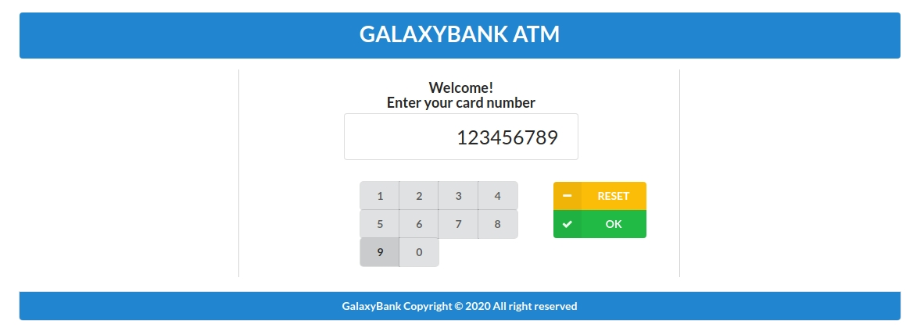
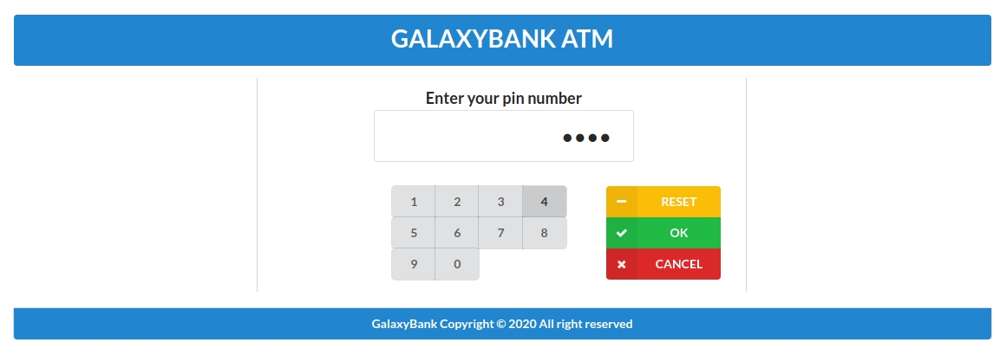
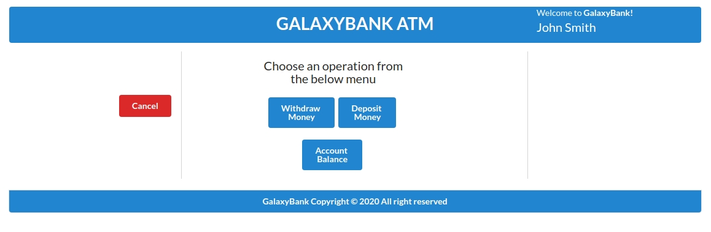
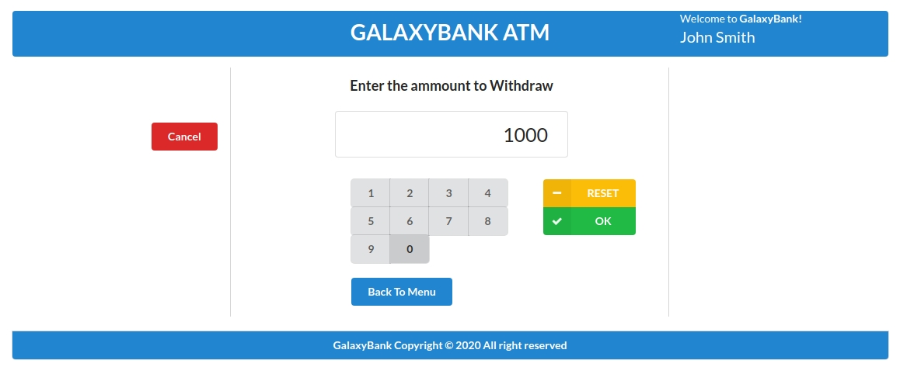
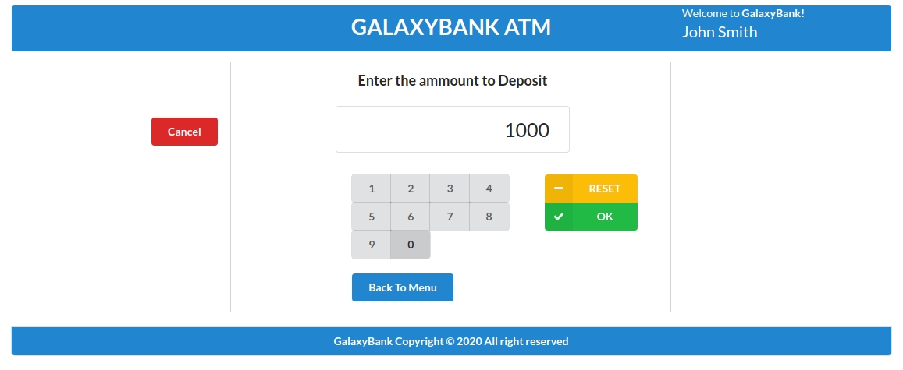
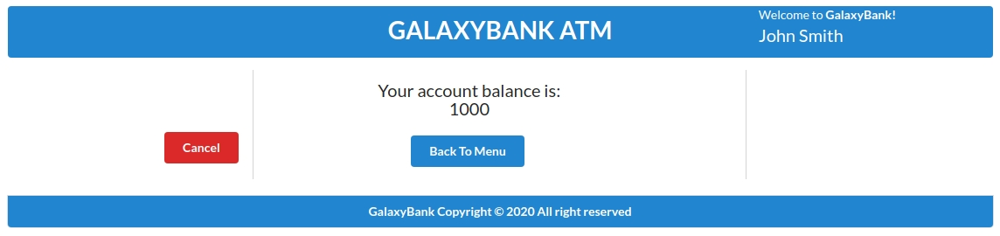
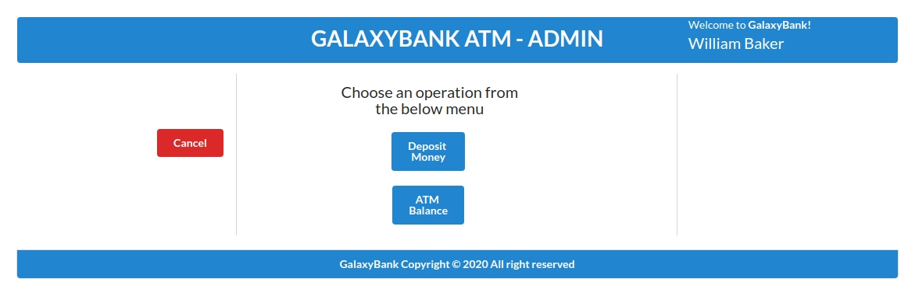
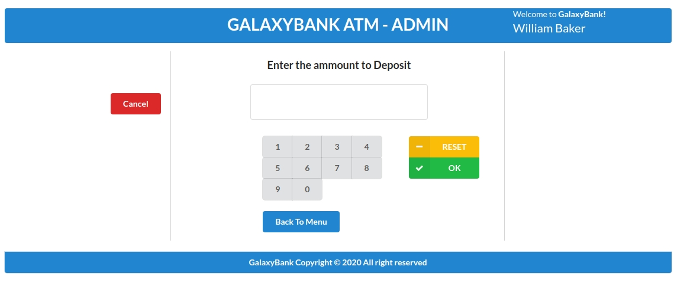
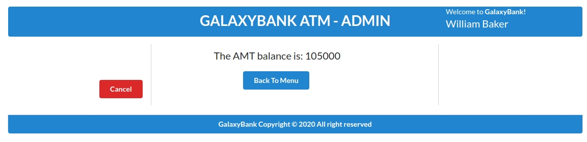

# README

SoftwareEnginering - Activity 2
================================================================================

Dependencies
================================================================================

    - Java 1.8+ 
    - Maven 3+
    - PosgreSQL 10.12 running in localhost, port 5432
    - Git
    
    
Building the application
================================================================================
Clone the Git project locally (e.g. /home/**YOUR_NAME**/projects)
 
    git clone https://github.com/josecmarcucci005/galaxybank-atm

Build the project with maven

    cd /home/YOUR_NAME/projects/galaxybank-atm
    
    mvn install
    
Running the application Locally
================================================================================
run the Jar file built in the previous step

    cd /home/YOUR_NAME/projects/galaxybank-atm
    
    java -jar target/*.jar

Now you should be able to access the ATM for customers panel

http://localhost:9081/galaxybank/

__ATM for customers welcome__

***for testing use card number 123456789

__ATM for customers pin__

***for testing use pin number 1234

__ATM for customers menu__

__ATM for customers Withdraw__

__ATM for customers Deposit__

__ATM for customers Check Balance__

And for the ATM admin panel

http://localhost:9081/galaxybank/admin

__ATM for Admin welcome__

***for testing use the email: will.baker@gmail.com and password: willbak@12

__ATM for Admin menu__

__ATM for Admin Deposit__

__ATM for Admin Check Balance__

Running DEMO
================================================================================
You can find a demo of the running application at the below links:

###ATM for customers panel
https://atm-galaxybank.herokuapp.com/galaxybank/

###ATM Admin panel
https://atm-galaxybank.herokuapp.com/galaxybank/admin